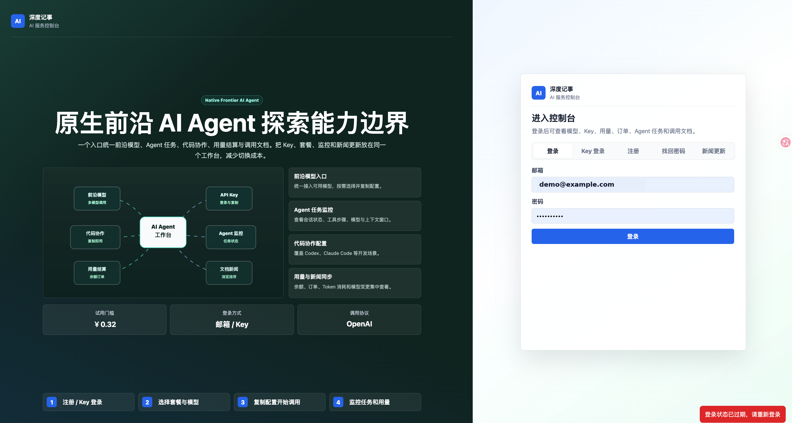
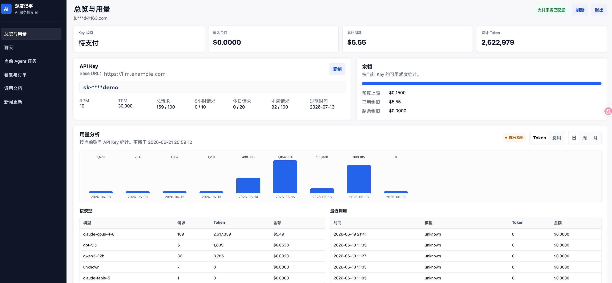
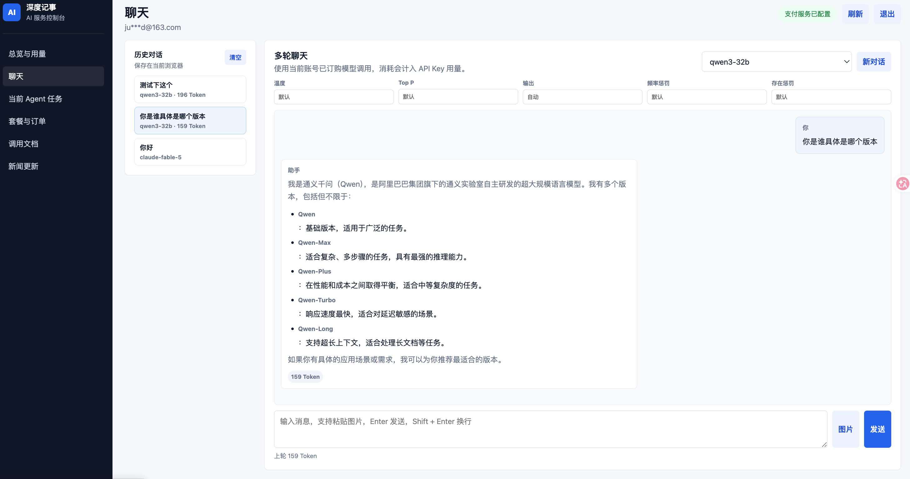
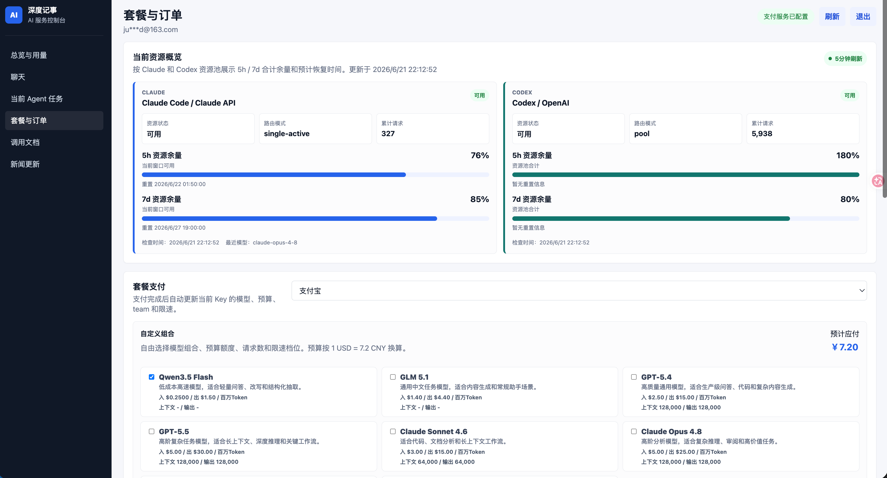
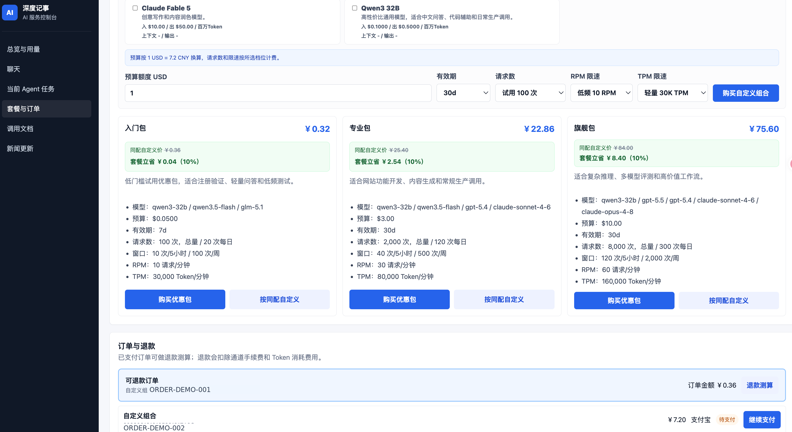
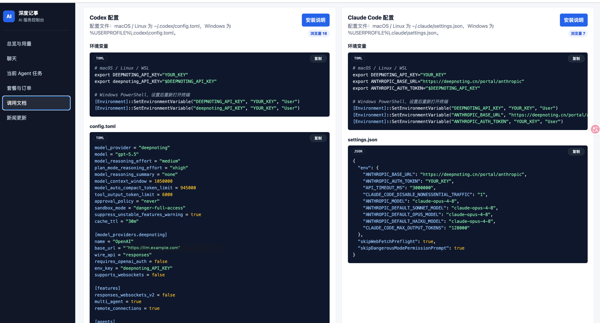
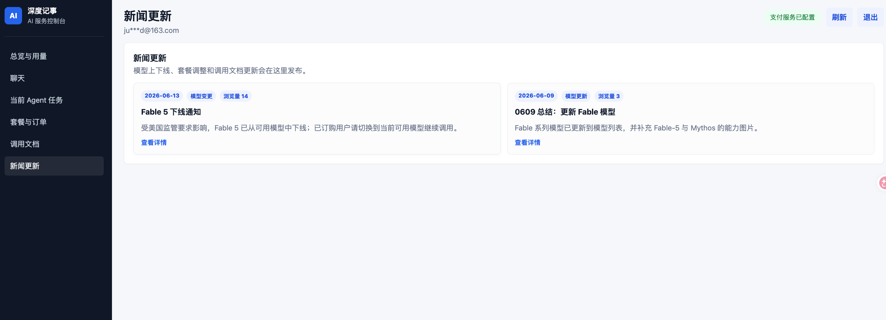

# AI Proxy Portal

[English](README.md) | **简体中文**

本文档是开源包的中文说明。默认入口是英文版 [README.md](README.md)，方便发布到 GitHub 等英文社区。

AI Proxy Portal 是一个基于 FastAPI 的 LiteLLM 用户门户。它不替代 LiteLLM，而是在 LiteLLM 之上提供账号、虚拟 API Key、套餐、支付、用量分析、浏览器聊天、调用文档和 Agent 任务上报等产品能力。

本目录是脱敏后的开源版本，已移除生产环境密钥、SQLite 数据库、内部服务域名/IP、支付凭据、邮件凭据、二维码图片和内部运维资料。

## 官网

在线门户：[https://deepnoting.cn/portal/](https://deepnoting.cn/portal/)

## 界面预览

### 登录与产品入口



### 用量工作台



### 浏览器聊天



### 资源状态与自定义套餐



### 预设套餐与退款流程



### API 与 Agent 配置文档



### 新闻更新



## 核心功能

- 邮箱密码注册、登录、退出、忘记密码和重置密码。
- 支持使用已有 LiteLLM 虚拟 API Key 直接登录。
- 自动创建、激活、冻结和更新 LiteLLM 虚拟 Key。
- 工作台展示当前 Key 状态、预算、余额、请求限制和过期时间。
- 用量分析按当前 API Key 统计请求数、Token、费用、模型分布和最近调用。
- 套餐购买流程，支持预设套餐和自定义组合。
- 可选接入 ZPay 兼容支付网关，支持支付 URL 生成和回调验签。
- 可选接入腾讯云 SES 邮件，用于注册、支付成功和密码重置通知。
- 管理后台可编辑模型目录、套餐、价格、额度和 LiteLLM team 设置。
- 浏览器聊天页使用当前用户自己的 LiteLLM Key 发起请求。
- 聊天支持文本、粘贴/上传图片、OpenAI 兼容多模态 content，以及常用生成参数。
- 支持本地和服务端聊天历史。
- Agent 任务面板可接收外部客户端上报的任务事件。
- 可选资源状态面板，用于展示上游账号池或模型资源状态。
- 内置 OpenAI 兼容 API 调用文档。
- 可选 Anthropic Messages 兼容代理，适合 Claude Code 先经过门户做预算校验再转发到 LiteLLM。
- 人工退款测算流程，可扣减订单预算并记录退款状态。

## 架构设计

```text
Browser
  |
  | /portal/
  v
FastAPI Portal
  |-- SQLite: users, sessions, orders, chat history, events
  |-- LiteLLM admin API: key, model, team, spend logs
  |-- LiteLLM user API: chat completions
  |-- Optional payment gateway callback
  |-- Optional email provider
  |-- Optional resource status API
```

核心分工：

- LiteLLM 负责模型网关、虚拟 Key、预算、模型权限、用量日志和限速。
- Portal 负责用户体验和业务流程，包括注册、登录、套餐、订单、支付、聊天、文档和用量展示。
- SQLite 保存门户自己的业务状态，例如用户、订单、会话、聊天记录和 Agent 事件。
- 支付、邮件、资源状态接口都是可选外部服务，可以按需启用。

## 目录结构

```text
portal/
  main.py                 FastAPI 路由、工作台聚合、聊天、支付、退款
  db.py                   SQLite 表结构和数据访问
  auth.py                 密码哈希和 token 生成
  litellm_client.py       LiteLLM Key、模型、team、用量和聊天 API 客户端
  catalog.py              模型/套餐/自定义价格配置加载和校验
  zpay.py                 支付 URL 签名和回调验签
  mailer.py               可选腾讯云 SES 邮件发送
  settings.py             环境变量和 JSON 配置加载
  static/                 前端页面、聊天页、文档页、管理页

config/
  external_services.json  安全示例服务地址
  portal_catalog.json     安全示例模型、套餐和自定义价格

deploy/
  ai-portal.service.example
  nginx-portal.conf.example
  nginx-litellm-anthropic-budget.conf.example

pngs/
  README.md               可选公开图片资源目录说明

ui/
  *.png                   README 使用的脱敏界面截图
```

## 环境要求

- Python 3.11 或更高版本。
- 一个正在运行的 LiteLLM proxy，并启用数据库支持的虚拟 Key。
- LiteLLM master key，用于 Portal 调用管理接口。
- 可选：Nginx 反向代理。
- 可选：ZPay 兼容支付网关。
- 可选：腾讯云 SES，或自行替换 `portal/mailer.py` 为其他邮件服务。

安装依赖：

```bash
python3 -m venv .venv
source .venv/bin/activate
pip install -r requirements.txt
```

## 配置

复制环境变量模板：

```bash
cp .env.example .env
```

最小本地配置：

```text
PORTAL_BASE_URL=http://127.0.0.1:8090
PORTAL_BIND_HOST=127.0.0.1
PORTAL_PORT=8090
PORTAL_DB_PATH=portal/data/portal.db
PORTAL_SITE_NAME=AI Proxy Portal
PORTAL_ADMIN_TOKEN=change-me-admin-token

LITELLM_BASE_URL=http://127.0.0.1:4000
LITELLM_PUBLIC_BASE_URL=http://127.0.0.1:4000
LITELLM_MASTER_KEY=change-me-litellm-master-key
```

`config/external_services.json` 提供公开 URL 和可选外部服务的默认值，环境变量会覆盖这些值。

`config/portal_catalog.json` 控制：

- LiteLLM team 信息。
- 对外展示的模型目录。
- 预设套餐。
- 自定义组合的预算范围。
- 请求次数档位。
- RPM/TPM 档位。
- 价格汇率和折扣。

生产环境需要把示例模型 id 替换为你的 LiteLLM 中实际配置的模型名。如果希望 Key 归属于某个 LiteLLM team，请设置：

```json
{
  "team": {
    "alias": "your-team-alias",
    "team_id": "your-litellm-team-id",
    "restrict_to_team_models": true
  }
}
```

如果 `team_id` 为空，Portal 会创建和更新不绑定 team 的 LiteLLM Key。

## 本地运行

先启动 LiteLLM proxy，然后启动 Portal：

```bash
source .venv/bin/activate
python -m uvicorn portal.main:app --host 127.0.0.1 --port 8090
```

打开：

```text
http://127.0.0.1:8090/
```

健康检查：

```bash
curl http://127.0.0.1:8090/health
```

管理后台：

```text
http://127.0.0.1:8090/admin
```

调用管理 API 时使用请求头：

```text
X-Admin-Token: <PORTAL_ADMIN_TOKEN>
```

## 基础验证流程

1. 启动 LiteLLM。
2. 配置 `.env`。
3. 启动 Portal。
4. 访问 `/`。
5. 注册用户。
6. 确认 LiteLLM 虚拟 Key 已创建。
7. 通过支付流程激活 Key，或在测试环境中手动更新 LiteLLM Key。
8. 查看工作台和 `/api/usage`。
9. 在聊天页选择当前 Key 可用的模型并发送消息。

如果使用 API Key 登录，把已有 LiteLLM 虚拟 Key 粘贴到 Key 登录表单即可。对于外部导入的 Key，Portal 会按当前 API Key hash 从 LiteLLM spend logs 中读取用量，避免只按邮箱查询导致统计为空。

## 聊天页

聊天页通过 Portal 转发请求，并使用当前用户自己的虚拟 Key。支持：

- 纯文本消息。
- 上传或粘贴图片。
- OpenAI 兼容多模态 content：

```json
{
  "role": "user",
  "content": [
    {"type": "text", "text": "What is in this diagram?"},
    {
      "type": "image_url",
      "image_url": {
        "url": "data:image/png;base64,...",
        "detail": "auto"
      }
    }
  ]
}
```

图片限制：

- 支持 PNG、JPG、WebP 和 GIF。
- 单张图片最大 5 MB。
- 单条用户消息最多 4 张图片。

模型是否能理解图片取决于 LiteLLM 中选择的模型以及上游供应商能力。

支持的常用生成参数：

- `temperature`
- `top_p`
- `max_tokens`
- `frequency_penalty`
- `presence_penalty`

## 支付集成

支付是可选能力。如果 `ZPAY_PID` 和 `ZPAY_KEY` 为空，创建支付订单会被禁用，但门户其他功能仍可运行。

启用支付后，Portal 会：

1. 根据套餐或自定义组合创建订单。
2. 生成签名后的支付 URL。
3. 接收异步支付通知。
4. 校验回调签名和金额。
5. 激活 LiteLLM 虚拟 Key。
6. 更新模型权限、预算、有效期、RPM 和 TPM。

回调地址来自 `PORTAL_BASE_URL`：

```text
{PORTAL_BASE_URL}/api/pay/notify
{PORTAL_BASE_URL}/return/{out_trade_no}
```

## 邮件集成

邮件是可选能力。如果腾讯云 SES 配置为空，发送会被跳过，并记录为 `skipped`。

当前使用场景：

- 注册成功通知。
- 密码重置。
- 支付成功通知。

如果使用其他邮件供应商，可以替换 `portal/mailer.py`，但建议保持以下函数签名：

- `send_registration_email`
- `send_password_reset_email`
- `send_payment_success_email`

## Nginx

以 `/portal/` 路径挂载 Portal 的示例：

```nginx
location = /portal {
    return 301 /portal/;
}

location /portal/ {
    proxy_pass http://127.0.0.1:8090/;
    proxy_set_header Host $host;
    proxy_set_header X-Real-IP $remote_addr;
    proxy_set_header X-Forwarded-For $proxy_add_x_forwarded_for;
    proxy_set_header X-Forwarded-Proto https;
    proxy_read_timeout 120s;
}
```

更多示例见 `deploy/nginx-portal.conf.example`。

Anthropic 兼容 Claude Code 预算代理可参考 `deploy/nginx-litellm-anthropic-budget.conf.example`。

## systemd

复制并修改服务示例：

```bash
sudo cp deploy/ai-portal.service.example /etc/systemd/system/ai-portal.service
sudo sed -i 's#/opt/ai-proxy#/your/deploy/path#g' /etc/systemd/system/ai-portal.service
sudo systemctl daemon-reload
sudo systemctl enable --now ai-portal
sudo systemctl status ai-portal --no-pager
```

## 数据存储

默认 SQLite 路径：

```text
portal/data/portal.db
```

数据库保存：

- 用户和密码哈希。
- LiteLLM 虚拟 Key 映射。
- 订单。
- 会话。
- 密码重置 token。
- 聊天历史。
- Agent 事件。
- 页面访问记录。

不要提交 SQLite 数据库文件。

## 安全注意事项

- 不要提交 `.env`。
- 不要提交 LiteLLM master key、API Key、支付密钥或邮件服务凭据。
- 生产环境必须设置强 `PORTAL_ADMIN_TOKEN`。
- 生产环境建议使用 HTTPS。
- SQLite 备份应私密保存。
- 发布 fork 前请检查所有静态文档和图片。
- 把示例域名、模型和套餐替换成自己的配置。
- 正式开源前请添加 LICENSE 文件。

## 本开源包已移除的内容

- 生产 `.env` 和真实环境变量值。
- SQLite 数据库。
- Python 字节码缓存。
- 内部部署说明。
- 内部服务域名、服务 IP 和二维码图片。官网演示地址会保留。
- 支付和邮件服务凭据。
- 私有截图和生成文档归档。

## License

当前脱敏导出未包含许可证。正式发布前请添加 MIT、Apache-2.0 或其他合适的 LICENSE 文件。
